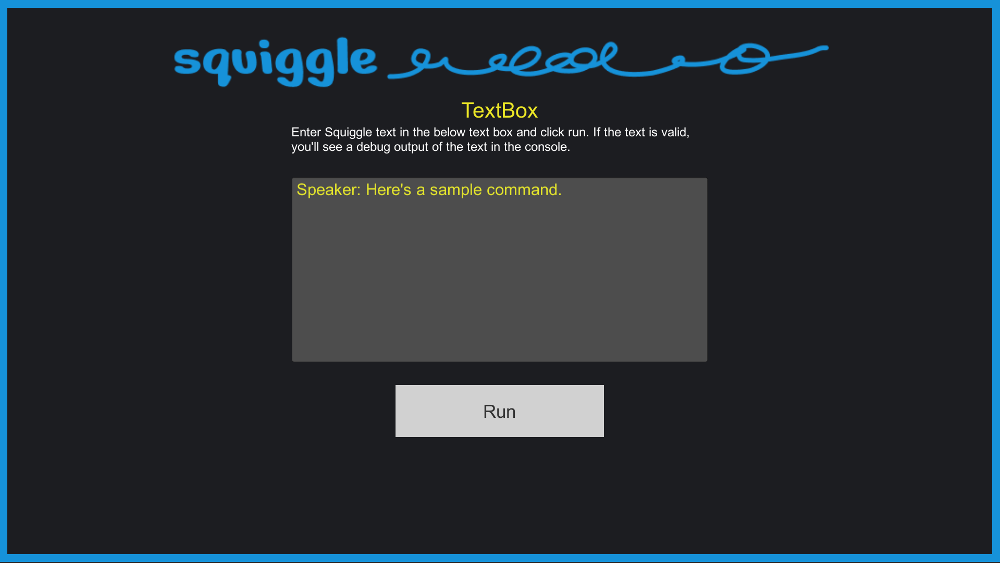

---

**NOTE: Squiggle is currently in preview mode - docs are incomplete and being actively added to. That said, there should be enough below to get started. The code of Squiggle itself is stable and used in production games.**

---
  
Squiggle ("**S**uper **Q**uick **G**ame **L**anguage") is a simple scripting language and runtime parser built for use inside of any C# game engine or framework (Unity, Monogame, etc.). With very little setup, you can easily get started adding custom dialog scripts and commands to your game.

Here's an example:
```
[playSound knock 1]
Carol: Hello! I've arrived!
Carol: And I've brought something special!
[playAnimation move carol door]
[setLights dim]
```

If you're familar with tools like [Yarn](https://yarnspinner.dev/) or [Twine](https://twinery.org/), Squiggle is "lite" version of those tool. It trades their robust feature sets for ultimate flexibility in order to be as quick and simple as possible.

## Use Cases
While Squiggle was primarily designed as a light scripting/dialog tool, you can think of it a *bit* like a code calling "playbook". From this lens, you can see how it could be used for many other use cases:

* Dialog Systems
* AI Routines
* Unit Testing
* Build Instructions
* etc.

Note: Squiggle is *not* a replacement for C# code in your game. Instead, it provides a way for you to interact with code you've already written. This also means that Squiggle is slighly more advanced that the aforementiond tools — you get less "out of the box" but can easily customize to your needs.

If instead you're looking for an easy-to-use, plug-and-play dialog system, I highly recommend looking into either [Yarn](https://yarnspinner.dev/), [Twine](https://twinery.org/), or [Ink](https://www.inklestudios.com/ink/)! However, if you've read the above and are still interested, keep reading for an overview of Squiggle and how to get started using it!

# Getting Started
To get started in Unity, you can download the latest Unity package here.

If you want to use Squiggle outside of Unity, you can directly download the DLLs here (Nuget coming soon).

## Unity Sample Scenes

The Unity packages contain sample scenes that you can use as a starting point for integrating Squiggle into your game, or as a template to copy for other projects.

You'll find four example scenes in the project, each demonstrating a different way to load and execute Squiggle code:
* Input Text Box - Write and execute Squiggle directly in play mode
* Monobehaviour - Write squiggle in a public monobeahvior string field
* Scriptable Object - Author squiggle in a ScriptableObject
* Streaming Assets - Load a squiggle file from StreamingAssets
* Dialog Progression - Show how to progress a squiggle script manually
* Custom Commands - Sample custom command that changes text color

## Absolute Basics

Squiggle code is a collection of `commands`, with **one** command on each line. The simplest command is a Dialog Command, which looks like this:

```
Speaker: Hello! The Speaker is talking!
```

You can pass this to Squiggle by calling a single function:
```cs
using Squiggle;

string myScript = "Speaker: Hello! The Speaker is talking!";
Squiggle.Core.Run(myScript);
```
The above code will read the text in `myScript` as Squiggle code and attempt to execute it. Squiggle will see that someone name `Speaker` is talking, and they are saying `Hello! The Speaker is talking!`.

### Runner Options / Printing to Console
Squiggle is "silent" by default, meaning if you run the above code, especially in Unity, it can seem like its not working. To get baseline "visibility", you can pass options to the Runner:

```cs
using Squiggle;

string myScript = "Speaker: Hello! The Speaker is talking!";
var options = new Squiggle.Runner.Options(){
    Debug = true
};
Squiggle.Core.Run(  squiggleText : myScript,
                    runnerOptions : options);
```

The above code will now print debug information that looks like this to the console (NOTE: Unity users need to do a second step, see below):

```
Squiggle Runner J+NeBhab4UGr6GBTW9BBBQ==: Beginning Runner Execution With 1 Commands
Squiggle Runner J+NeBhab4UGr6GBTW9BBBQ==: Starting Execution for Command Type Dialog With Args: (0)Speaker (1)Hello! The Speaker is talking!  
Squiggle Runner J+NeBhab4UGr6GBTW9BBBQ==: Completed Execution for Command Type Dialog With Args: (0)Speaker (1)Hello! The Speaker is talking! 
Squiggle Runner J+NeBhab4UGr6GBTW9BBBQ==: Execution Complete, Exiting
```

**If you're using Unity, you'll also need to specify a logging callback function in the options**:

```cs
using Squiggle;

string myScript = "Speaker: Hello! The Speaker is talking!";
var options = new Squiggle.Runner.Options(){
    Debug = true,
    LogHandler = (text) => Debug.Log(text)
};
Squiggle.Core.Run(  squiggleText : myScript,
                    runnerOptions : options);
```

If you use the above code, the code will run and then immediately exit. This may not be desireable, as you'll likely want to "catch" the dialog, and handle it somewhere else in your code. You can specify a dialog callback with the `DialogHandler` parameter to handle dialog when running Squiggle code to achieve this:

```cs
using Squiggle;

string myScript = "Speaker: Hello! The Speaker is talking!";
var options = new Squiggle.Runner.Options(){
    Debug = true,
    LogHandler = (text) => {Debug.Log(text)},
    DialogHandler : (command) => {
        // This will automatically complete the dialog
        Squiggle.Events.Commands.CompleteDialog?.Invoke(command);
    }
};
Squiggle.Core.Run(  squiggleText : myScript,
                    runnerOptions : options);
```

The above code will still immediately "complete" the dialog, but you can see how you could instead call out to other functions to process the dialog, then call `Squiggle.Events.Commands.CompleteDialog?.Invoke(command)` elsewhere when finished (like when a player presses the "advance" button in a dialog UI).

You can see more robust examples like this in the Unity package sample scenes.

## Multiple Commands
Squiggle code can contain as many lines as you like, with a single command being on each line (read more here about what constitutes valid Squiggle source).

```cs
using Squiggle;

string myScript = @"
Speaker: Hello! The Speaker is talking!
Speaker 2: Now Speaker 2 is talking.
Speaker 3: And here's a word from Speaker 3.
";

Squiggle.Core.Run(testScript);
```

## Non-Dialog Commands
In addition to Dialog, Squiggle gives you the ability to call other types of commands inside of your scripts.

Non-Dialog commands take the form:
```
[commandName commandArgument1]
```
`commandName` above is the name of the command, and `commandArgument1` is an argument to pass to that command. Squiggle ships with a small set of commands that provide some utility for script execution:

### Wait
You can call the `wait` command in your scripts to pause execution of the script from some number of milliseconds:

```cs
using Squiggle;

string myScript = @"
[wait 1000]
Speaker: I've waited 1 second to start speaking
[wait 1000]
Speaker: Now afer a second I'm speaking again
[wait 1000]
";

Squiggle.Core.Run(testScript);
```

The code above will wait for 1 second, execute the first speaker text, wait another second and execute the second speaker text, then wait another second and end the execution of the code.

**If you're using Unity, you'll also need to specify a wait override callback function in the options**:

```cs
using Squiggle;

string myScript = @"
[wait 1000]
Speaker: I've waited 1 second to start speaking
[wait 1000]
Speaker: Now afer a second I'm speaking again
[wait 1000]
";

string myScript = "Speaker: Hello! The Speaker is talking!";
var options = new Squiggle.Runner.Options(){
    Debug = true,
    WaitOverride = (command) => StartCoroutine(WaitMs(command))
    LogHandler = (text) => {Debug.Log(text)},
    DialogHandler : (command) => {
        // This will automatically complete the dialog
        Squiggle.Events.Commands.CompleteDialog?.Invoke(command);
    }
};
Squiggle.Core.Run(  squiggleText : myScript,
                    runnerOptions : options);

IEnumerator WaitMs(Squiggle.Commands.Wait waitCommand)
{
    yield return new WaitForSeconds(waitCommand.WaitMS / 1000f);
    waitCommand.CommandExecutionComplete?.Invoke();
}
```

For more on async/syncronous execution of Squiggle, see the wiki page here.


### Custom Commands
Squiggle's flexibility lies in its ease of authoring custom behaviour to tie into from scripts. To learn about custom command authoring, view the wiki page here.

## Documentation
For a deeper dive on Squiggle's features and operation, view the wiki here. In it you can find:
* General Squiggle Overview
* Instructions for custom command authoring
* Comparison to Yarn
* Command Execution Control


